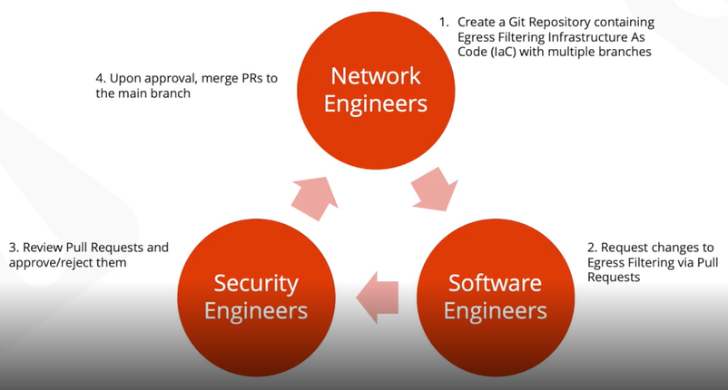
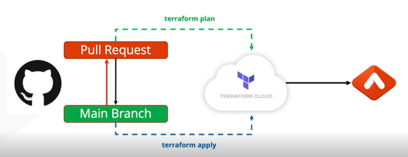

# Aviatrix Certified Engineer - Infrastructure as Code
### All environment changes will be made via TERRAFORM NOT the Aviatrix Controller UI
1. Lecture Module
2. Walkthrough of Lab Guides (Overview)
3. Walkthrough of Lab 1 (Day 0)
   1. Connect Terraform account to Github account
   2. Fork a Remote Repository and personalize code
   3. Build a Multi-Cloud Infrastructure from scratch 
4. Walkthrough of Lab 2 (Day 1)
   1. Enhance Infra from Lab 1
   2. Create Segmentation Connection Policy
   3. Resize Gateways
5. Walkthrough of Lab 3 (Day 2)
   1. Secure
   2. Creating, Automating, and Securing a Github Branch
   3. Build CI/CD pipeline with guardrails 
END

SCRIPTS provide AUTOMATION
- Shell Scripts
- Python Scripts

DevOps goal is to increase organizations ability to delivery applications and services at high-speed with better quality and security
- CI/CD pipelines
  - **Continuous Integration** (CI) -> whenever a developer checks in code to the source repository, a build is **automatically** triggered (Jenkins - extensible and lots of plug-in support)
  - **Continuous Delivery** (CD) -> Automates the delivery of applications to selected infrastructure environments. Every change is prove to be **deployable** at any time
    - still need to decided when to deploy
    - can be deployed in dev, test/staged, prod
  - CI/CD pipeline is the iterative process that automates software delivery using CI and CD
    - automated process with standardized feedback loops to developers 
    - change in source code repository triggers a notification to the CI/CD tool which runs CI/CD pipeline
      - build -> test -> deploy 
- Version Control Systems (VCS)
  - manage the lifecycle of files
  - Github, BitBucket, GitLab, Azure DevOps

Deploy infrastructure at scale using principles of DevOps

Use GitHub actions to create CI/CD pipeline

Cloud allows Developers to delivery applications and services with speed and agility.
DevOps is Networking teams responding with the same speed and agility that comes with deploying in the cloud.

Workflow for Network Engineers
1. Create remote repository on GitHub
   - From Scratch
   - By Forking (make a copy of an existing repo from GitHub to your account)
2. Clone a repository
   - download a repository that serves as a local working development copy
   - allows you to work in IDE of our choice
3. Use the default branch (Main*)
4. After editing files, must save to GitHub
   1. git add - stage the file(s)
   2. git commit - create a snapshot of the stage with a log message
   3. git push - push the commit to the remote repository on GitHub

What is Infrastructure as Code (IaC)
- The management of infrastructure (networks, virtual machines, load balancers, and connection topology) in a descriptive model, using the same version as DevOps team uses for source code. Like the principle that the same source code generates the same binary, an IaC model generates the same environment every time it is applied.

- Cloud-native IaC tools
  - AWS - CloudFormation
  - Azure - Azure Resource Manager
  - GCP - Deployment Manager
- Cloud-agnostic IaC tool -> Terraform

Terraform
- software tool
- created by Hashicorp
- Write Declarative configuration files in Hashicorp Configuration Language (HCL)
  - every file ending in '.tf' will be considered

terraform plan - define desired state
- Plan and predict changes (add, change, destroy)
terraform apply - reproducible infrastructure
- Idempotent - if resource already exists, it won't recreate it
State - maintains knowledge of resources in a database
- what terraform believes infra, resources looks like
- if changes are made out of state, terraform will need to be updated

Every CSP has a Terraform Provider
Aviatrix has a Terraform Provider

Modules are like programming librarys
- can use and reuse

Terraform Best Practices
- Network engineers work closer with Developers
- Store Terraform State remotely in a shared environment
- Make changes ideally in 1 place either Aviatrix UI or Terraform
- Implement guard rails with Branch Protection

NetOps -> DevOps , Networking (reducing risk in IaC)
Day 2 Ops
Risk Mitigation & Guard Rails
Egress Security

Egress Filtering - Stakeholders
- Software engineers
  - building applications that have egress requirements
- Network engineers
  - Responsible for provisioning and maintaining network infrastructure
- Security engineers
  - Responsible for ensuring that software and networks are secured

1. NetOps uses Terraform to declare infra with different branches for staging
2. Software edits 1 terraform file listing the FQDNs that the app will reach then make a pull request
3. SecOps reviews pull request
4. NetOps merges change to the main branch (golden)

Code -> Pull Request -> Terraform Plan -> Terraform Cloud

Code -> Main Branch -> Terraform Apply -> Terraform Cloud

No changes are allowed on Main Branch
changes are made on another branch
do not get pushed to main branch until approved by a stakeholder (SecOps)